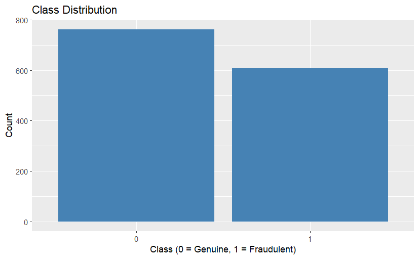
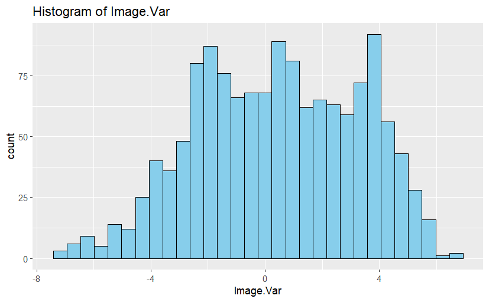
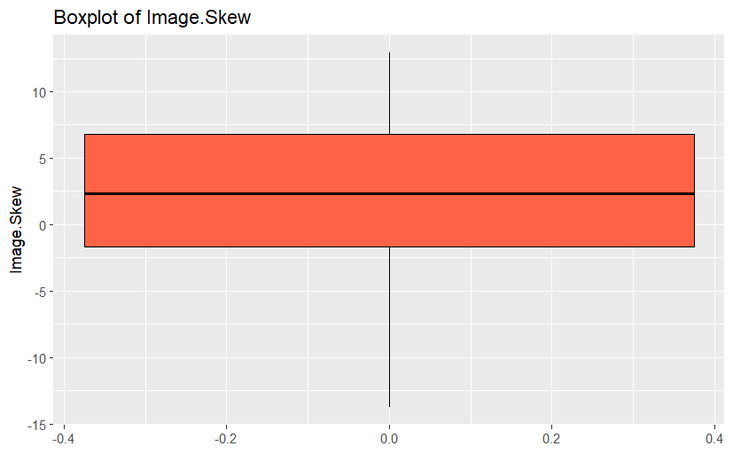
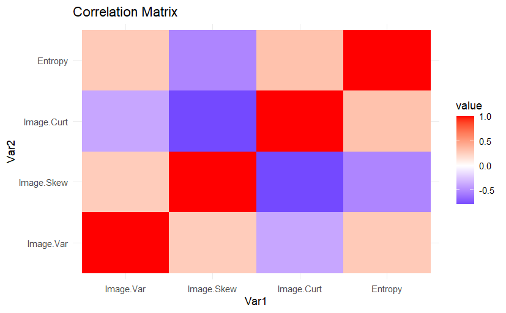
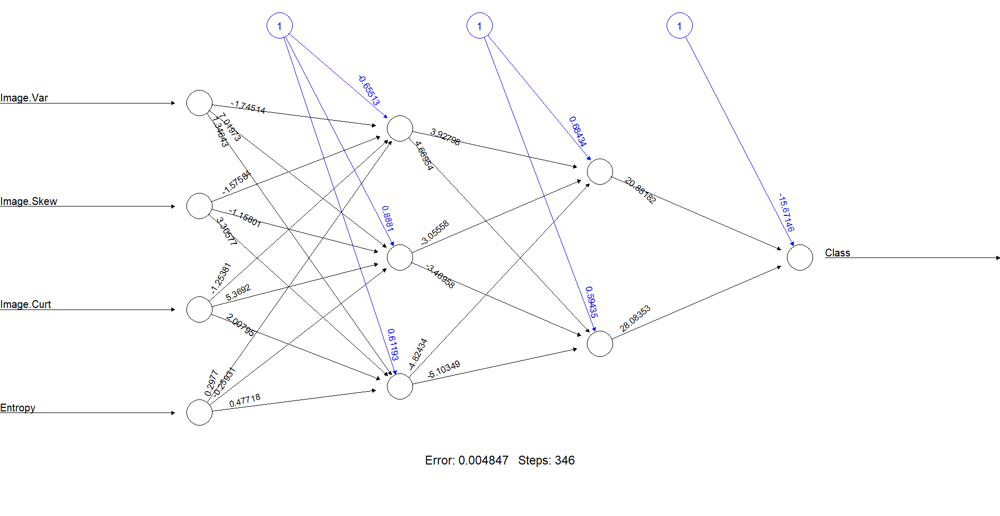
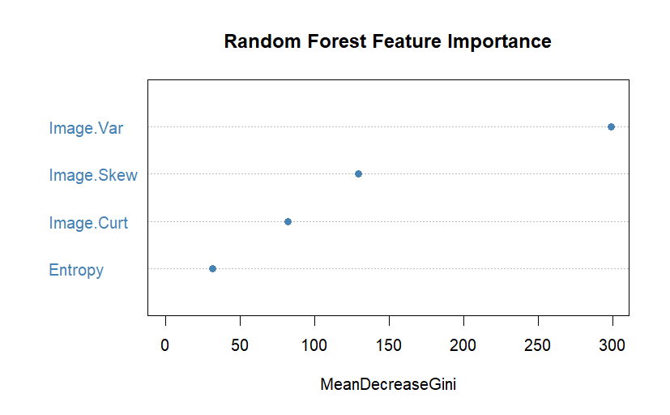

# 🏦 Bank Note Fraud Detection using Machine Learning

## 📌 Project Overview
This project builds and compares two machine learning models—a **Neural Network** and a **Random Forest**—to classify bank notes as genuine or fraudulent. The dataset used is the [UCI Bank Authentication Dataset](https://archive.ics.uci.edu/ml/datasets/banknote+authentication), which contains numerical attributes extracted from banknotes using wavelet transforms.

### 🔹 Key Features
- **Exploratory Data Analysis (EDA):**
  - Summary statistics, class distribution, and feature correlations.
  - Histograms and boxplots for feature visualization.
- **Data Preprocessing:**
  - Handling missing values and standardizing features.
  - Splitting the dataset into training (80%) and testing (20%).
- **Neural Network Model:**
  - Implemented using the `neuralnet` package.
  - Hyperparameter tuning for optimal hidden layer configuration.
  - Model visualization and performance evaluation.
- **Random Forest Model:**
  - Implemented using `randomForest` for comparison.
  - Feature importance analysis.
- **Model Evaluation:**
  - Performance comparison using accuracy, precision, recall, and F1-score.
  - Cross-validation for robustness.
  - Confusion matrices for both models.

## 📊 Exploratory Data Analysis (EDA)
### Class Distribution


### Feature Distributions
#### One of the feature histograms


#### One of the feature boxplots


### Correlation Matrix


## ⚙️ Data Preprocessing
```r
# Standardize numeric features
data_std[, (feature_names) := lapply(.SD, scale), .SDcols = feature_names]

# Train-test split using caTools
set.seed(123)
split <- sample.split(data_std$Class, SplitRatio = 0.8)
train_data <- subset(data_std, split == TRUE)
test_data <- subset(data_std, split == FALSE)
```

## 🤖 Neural Network Model
The neural network is trained using `neuralnet`, with hyperparameter tuning to find the best hidden layer configuration.

```r
# Define formula for the model
nn_formula <- reformulate(feature_names, response = "Class")

# Train neural network
nn_model <- neuralnet(
  nn_formula, data = train_data, hidden = c(3, 2), linear.output = FALSE, stepmax = 1e6
)

# Plot neural network
plot(nn_model)
```

### Neural Network Visualization


## 🌲 Random Forest Model
A **Random Forest** model is trained for comparison, and feature importance is analyzed.

```r
# Train Random Forest model
rf_model <- randomForest(Class ~ ., data = train_data, ntree = 100)

# Feature Importance Plot
varImpPlot(rf_model, main = "Random Forest Feature Importance")
```

### Feature Importance Plot


## 📉 Model Performance Comparison
| Model          | Accuracy | Precision | Recall  | F1-Score |
|---------------|----------|----------|--------|---------|
| Neural Network | 1.0000   | 1.0000   | 1.0000 | 1.0000  |
| Random Forest  | 0.9927   | 1.0000   | 0.9868 | 0.9934  |

## 🛠️ Cross-Validation
To further validate our models, **5-fold cross-validation** is applied to the neural network.

```r
# Perform 5-Fold Cross-Validation
folds <- createFolds(data_std$Class, k = 5)
cv_accuracies <- sapply(folds, function(fold) {
  cv_train <- data_std[-fold, ]
  cv_test <- data_std[fold, ]
  cv_model <- neuralnet(nn_formula, data = cv_train, hidden = c(3, 2), linear.output = FALSE, stepmax = 1e6)
  predictions <- compute(cv_model, cv_test[, feature_names])$net.result
  mean(ifelse(predictions > 0.5, 1, 0) == cv_test$Class)
})

cat("Mean CV Accuracy:", mean(cv_accuracies))
```

## 📌 Insights & Conclusion
- The **Neural Network** achieves perfect classification accuracy on the test set, but it may be prone to overfitting.
- The **Random Forest** model performs slightly worse but remains highly accurate and robust.
- **Feature Importance Analysis** (via Random Forest) reveals which attributes contribute most to classification.
- **Cross-validation** ensures the models' generalizability.

## 🚀 How to Run the Project
### Prerequisites
Ensure you have the required R packages installed:
```r
install.packages(c("data.table", "ggplot2", "neuralnet", "randomForest", "caTools", "caret", "knitr", "dplyr", "reshape2"))
```

### Running the Script
Clone the repository and run the R script:
```sh
git clone https://github.com/YOUR_GITHUB_USERNAME/Bank-Note-Fraud-Detection.git
cd Bank-Note-Fraud-Detection
Rscript banknote_fraud_detection.R
```

## 📜 License
This project is licensed under the MIT License.

## 📬 Contact
- **Name:** Shaurya Sethi
- **Email:** shauryaswapansethi@gmail.com

Feel free to contribute or provide feedback!

---


